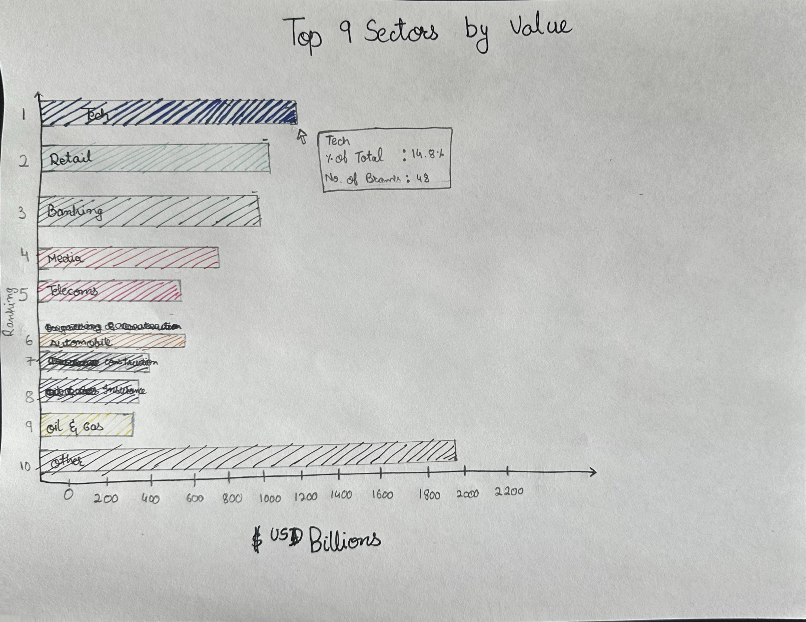

| [home page](https://cmustudent.github.io/tswd-portfolio-templates/) | [visualizing debt](visualizing-government-debt) | [critique by design](critique-by-design) | [final project I](final-project-part-one) | [final project II](final-project-part-two) | [final project III](final-project-part-three) |

# Title
Text here...

_For each step below, you should document your progress as you move forward.  In terms of tone, think of the writeup as though you're keeping journal of your step-by-step process.   You should include a any insights you gained from the critique method, and what it led you to think about when considering the redesign.  You should talk about how you moved next to the sketches, and any insights you gleaned from your user feedback.  Document what you changed based on the user feedback in your redesign.  Finally, talk about what your redesigned data visualization shows, why you selected the data visualization you did, and what you attempted to show or do differently._

_You can include screenshots, sketches or other artifacts with your narrative to help tell the story of how you moved through the process.  Again, make sure to avoid including any personally identifying information about your interviewees (don't list full names, etc.).  While this template serves as a guide, make sure to reference the assignment writeup on Canvas for the official guidance.  This template does not include all guidance mentioned on the assignment page._

## Step one: the visualization

 
I chose this visualization because it offers a quick snapshot of brand value across sectors, which is critical for understanding market leadership. The original visual from Brand Finance Global 500 - 2023 Report. Which effectively highlights key sectors and shows their share of global brand value. However, the donut chart format made comparing sectors with similar values hard, and more detailed insights about the specific brands within each sector were needed.

I saw an opportunity to improve the clarity and relevance of this visual, especially for business executives who need to identify leading brands for potential partnerships. My goal was to simplify the design, focus on top brands, and make the data more actionable for strategic decision-making.

Access to the report: https://static.brandirectory.com/reports/brand-finance-global-500-2023-preview.pdf

## Step two: the critique
_Don't forget to complete the Google Form found on the assignment page.  You can summarize your thoughts here._

## Step three: Sketch a solution

## Step four: Test the solution
Results: 

| Question | Interview 1 (Student, Mid-20’s) | Interview 2 (Adult, Early-30’s) |
|----------|-------------|-------------|
|What’s your first impression of this visualization?          |I can tell it’s showing how different sectors are compared in terms of brand value. The title, Top 9 Sectors by Value, clearly indicates the focus, and the bar chart layout makes it easy to understand. I immediately knew I was looking at ranked data with each sector represented by a different colored bar.             |It’s straightforward to follow. The bar chart format is familiar, so I can quickly tell it’s comparing sectors by brand value. You’ve done a “good job simplifying the data.”             |
|What do you think the chart is trying to convey?          |The chart illustrates the brand values of various sectors in billions of USD. It’s organized from the highest value sector at the top down to the lowest, which is helpful because it shows the hierarchy between sectors clearly. But I got confused when I saw ‘other’ at the end, which accounted for the highest total value.             |The ranking by brand value is clear. I’d suggest removing the x-axis title (“$USD Billions”) and just putting the dollar signs on the values themselves. It would make the chart look cleaner.             |
|Did anything about the design confuse you or make you pause?         |The tooltip where you include percentages and number of brands. I can tell they represent a portion of the total brand value, but I wasn’t sure if that was needed. Also, I wasn’t entirely sure about the choice of colors. Maybe plan to add a legend to explain the colors.             |The sector names could be moved outside to the y-axis. It would remove the need for the ranking labels on the side, making the chart less cluttered. Also, you could simplify the visual by adding another column to the table for extra details.             |
|Who do you think would benefit most from looking at this chart?|This seems useful for business professionals or analysts trying to understand which sectors hold the most brand value. It’s presented in a way that makes it easy to compare, which I think would be helpful for that audience.             |Seems like a business professional or analyst. It’s clear enough for that audience. But if you’re aiming for a general audience, simplifying it further would make it more accessible.             |
|If you could make one or two adjustments to improve this, what would they be?          |I would change how the percentage values are displayed. They could be embedded inside the bars. Another idea is to simplify the color scheme. Right now, a lot is going on, so have a legend to explain any significant color choices you have made.             |Remove the x-axis title and label the values with dollar signs. Move the sector names outside the bars and remove the ranking labels.              |
|In your opinion, what are the biggest strengths and weaknesses of the chart?          |The chart is organized and somewhat shows the sectors’ ranking by brand value. A bar chart is effective because it’s an easy-to-understand format and allows for direct comparison between sectors. Weaknesses: The dynamic/hovering feature could confuse viewers, and the color scheme could be simplified to improve readability and reduce visual clutter, making the data easier to interpret.             |Strengths: It’s clear, easy to follow, and simplifies the original data well. The bar chart format makes comparisons simple. Weaknesses: Some design changes are needed to make it look less cluttered. Adding more columns of essential data or clipart to the sector can make it visually appealing.             |

**Synthesis:**

Based on interviews, I identified that the visual needs a cleaner and more simplified version, which is less cluttered in design. They emphasized simplifying the color scheme and remodeling the visual by moving the labels more efficiently, such as moving sector names outside the bars. 

Additionally, the x-axis title ($USD Billions) should be removed, and dollar signs should be incorporated into the values. This feedback indicates that the final redesign should focus on clarity, minimizing visual clutter, and making the data more accessible for professionals to interpret at a glance.

## Step five: Instructors Feedback

The instructor and the teaching assistant recommended looking into the metadata for the dataset. For instance, looking into the different brands that fall under the sector. Giving me a detailed understanding of the sectors and enhance the analysis. 

Additionally, the feedback suggested tailoring the visualization to suit the perspective of an executive, such as the CEO of a tech company, to aid in making decisions around potential partnerships with leaders in different sectors. The focus was on creating a static, clear, and less cluttered visualization that was visually appealing to an executive audience.

**Actions Taken:**
1. **Scraping and Organizing Data:** Using ChatGPT, I scraped the report and reviewed the website to get a comprehensive list of brands under each sector. I then classified the data to highlight the top 3 brands in each sector, providing more context to the visualization and making it easier for executives to identify key players.

2. **Tailoring for Executive Use:** I designed the visualization with a CEO or executive in mind. In particular, I aimed to support someone in the tech sector who might be considering partnerships with top brands in other sectors. With this context in mind, I ensured the visualization was Static and Less Cluttered.

3. **Simplified Color Scheme:** I used ColorBrewer to choose a simple and consistent color palette to keep the visual look professional, as discussed in the course. This enhances clarity and ensures the colors are easy to distinguish, even in a static format.

4. **Executive Focus:** By keeping the visual clean and focused, I aimed to present data to allow an executive to quickly grasp key insights, such as which sectors are leading and which brands are the top performers in those sectors. This helps facilitate decision-making without overwhelming the viewer with unnecessary details.

## Step six: Build the Final Solution

  <noscript>
    
  </noscript>
  <object class='tableauViz'  style='display:none;'>
    <param name='host_url' value='https%3A%2F%2Fpublic.tableau.com%2F' />
    <param name='embed_code_version' value='3' /> 
    <param name='site_root' value='' />
    <param name='name' value='Project1_17266222988410&#47;GlobalBrandValuebySector' />
    <param name='tabs' value='no' />
    <param name='toolbar' value='yes' />
    <param name='static_image' value='https:&#47;&#47;public.tableau.com&#47;static&#47;images&#47;Pr&#47;Project1_17266222988410&#47;GlobalBrandValuebySector&#47;1.png' /> 
    <param name='animate_transition' value='yes' />
    <param name='display_static_image' value='yes' />
    <param name='display_spinner' value='yes' />
    <param name='display_overlay' value='yes' />
    <param name='display_count' value='yes' />
    <param name='language' value='en-US' />
  </object>

                

The finalized version of the visualization, as seen above, titled "Global Brand Value Landscape: Key Players Across Sectors," has been tailored to help executives, particularly CEOs, in identifying potential partnership opportunities across various sectors. The visual features a clear and clean bar chart showcasing the brand value of the top sectors, with the brand value represented in billions of USD. The visual also includes the top three brands in each sector, providing an immediate view of key players. It can help the executive make any key decision about partnering with some of the leaders in different sectors.

Simplified the color scheme to enhance clarity without overwhelming the viewer. The x-axis values have dollar signs for easier interpretation, and sector names are placed directly inside the bars for a more streamlined look. This static, easy-to-read visualization is ideal for an executive audience, offering strategic insights in a less cluttered and more professional format.
