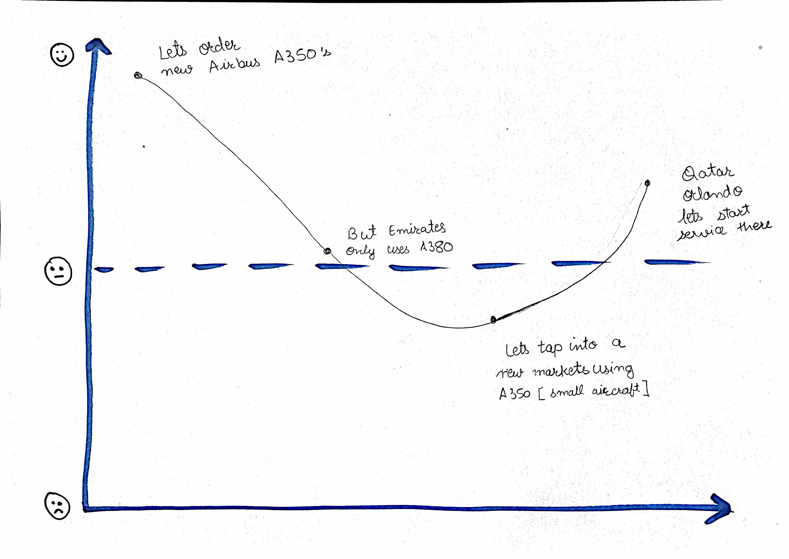
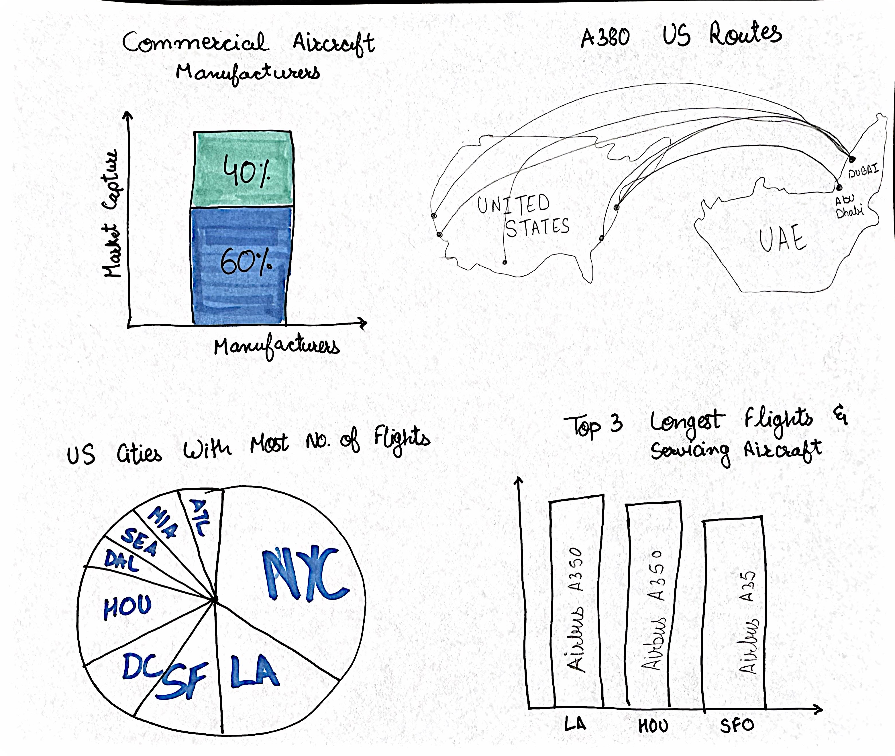

| [home page](https://cmustudent.github.io/tswd-portfolio-templates/) | [visualizing debt](visualizing-government-debt) | [critique by design](critique-by-design) | [final project I](final-project-part-one) | [final project II](final-project-part-two) | [final project III](final-project-part-three) |

# Outline
> Understanding how the ‘Big Three’ Middle East airlines — Emirates, Qatar, and Etihad Airways are handling the in-demand US routes with their current fleet. Etihad plans to expand its footprint in the US and order new aircraft. 
 
The focus of this project is to provide strategic insights to the CEO of Etihad Airways regarding the profitability of US routes and optimal allocation of the newly acquired Airbus A350 aircraft. As Etihad expands its fleet with new A350s, the airline needs to make data-driven decisions on utilizing this aircraft model best to maximize profitability and efficiency on US routes. The project will analyze flight data for Etihad’s current US routes, examining seat capacity, flight frequency, distance, and aircraft type factors. Allowing the airline to see how some of the direct competitors are doing and how it had been most helpful to them when it comes to handling flights to and from the USA.

Through various visualizations, I plan to provide actionable insights into routes that generate the highest profitability, how the A350s can be effectively distributed across routes, and where reallocating existing double-deckers (A380/B787) to improve operational efficiency and carbon footprint.

> Below is the project structure that outlines the major elements of your story.

Throughout the final project, I plan to understand better how the competitors have historically tackled US-bound flights so that at Ethaid, we can efficiently allocate the fleet and increase aircraft efficiency.

Also, as Ethaid is expecting the delivery of new A350s, which have [roven to be efficient in long-haul flights, and the Qatar fleet consists of the majority of those so, will work on analyzing the suitability of Airbus A350 by looking at the seating capacity and current routes, in addition to that, we need to understand how they can enter a new city by servicing them before the competitor enters. The goal will be to recommend routes where the A350s can replace less efficient aircraft and maximize fuel efficiency and profitability. I will create visuals that compare seat capacity for different aircraft types.

Likewise, it also optimized A380 double-decker usage. While we expect new A350s, this section will explore opportunities to reallocate some of the existing A350s to other routes. The analysis will focus on shifting the A350s to routes where their superior fuel efficiency and capacity can be better utilized, leading to improved profitability and sustainability. Overall, this project will focus on the profitability and efficiency of Etihad’s US routes, providing the CEO with clear, data-backed strategies for making informed decisions about aircraft allocation.

## Initial sketches
> Post images of your anticipated data visualizations (sketches are fine). They should mimic aspects of your outline, and include elements of your story.  

# The data
> [Link to access the article](https://simpleflying.com/emirates-etihad-qatar-airways-us-networks-comparison/)
> 
The primary data source comes from Simple Flying, a well-known source for the latest trends and news in the aviation industry. This article discusses the most recent airline routes, connectivity, and seat capacity across three Middle Eastern airlines (Emirates, Etihad, and Qatar Airways). The dataset includes comprehensive flight information for September 2024, breaking down each airline’s operational details, like the number of routes. I manually broke down further information like departure and arrival cities. Likewise, we can see the distances, number of flights, and aircraft types. 

A quick overview of the data (by Simple Fly) shows Emirates rates 14 routes, Qatar Airways has 11, and Etihad flies 4 routes. These routes are operated by aircraft, including the A380-800 and A350-1000, covering distances up to 8,334 miles. The distance and aircraft usage will help highlight each airline’s strategy for the US market. By comparing route efficiency and capacity, the data can support a business analysis of these airlines’ understanding of the approaches to serving long-haul US destinations.

> Link to the dataset I uploaded to Github which consists of the data I will use to conduct this analysis.

# Method and medium
> I plan to use Tableau Dasboard to make the visuals more engaging/interactive or RAWGraphs to build static visualizations.

Providing a clear and interactive overview of the insights. These tools will allow me to visualize key metrics, such as route profitability and aircraft allocation, in a way that helps Etihad’s CEO better understand passenger demand, route efficiency, and how to allocate their Airbus fleet strategically.
