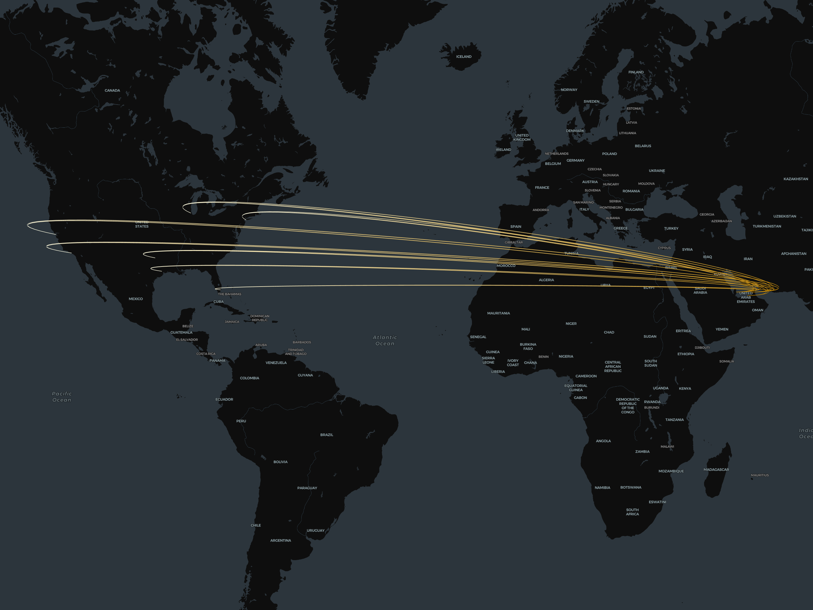

| [home page](https://dsahil12.github.io/SahilDesai-Portfolio/) | [visualizing debt](visualizing-government-debt) | [critique by design](critique-by-design) | [final project I](final-project-part-one) | [final project II](final-project-part-two) | [final project III](final-project-part-three) |

# The Final Data Story
> Below is the landing page (dashboard 1), which gives an overview of Etihad Airways' United States of America operations, fleet expansion, and market potential. Providing insights into key Americas hubs, focusing on flight density, fleet expansion plans, and global market trends. While giving you insights on fleet allocation, the data highlights the newly ordered Airbus A350 and the existing inventory of Boeing 787 aircraft. This helps strategize and maximize profitability while enhancing long-haul capabilities. Explore how Etihad can leverage these insights for efficient aircraft deployment and a stronger market presence.

    <noscript>
        
    </noscript>
    <object class="tableauViz" style="display: none;">
        <param name="host_url" value="https%3A%2F%2Fpublic.tableau.com%2F" />
        <param name="embed_code_version" value="3" />
        <param name="site_root" value="" />
        <param name="name" value="FinalProject_17280005525260/OverviewofEtihadsU_S_OperationsFleetExpansionandMarketPotential" />
        <param name="tabs" value="no" />
        <param name="toolbar" value="yes" />
        <param name="static_image" value="https://public.tableau.com/static/images/Fi/FinalProject_17280005525260/OverviewofEtihadsU_S_OperationsFleetExpansionandMarketPotential/1.png" />
        <param name="animate_transition" value="yes" />
        <param name="display_static_image" value="yes" />
        <param name="display_spinner" value="yes" />
        <param name="display_overlay" value="yes" />
        <param name="display_count" value="yes" />
        <param name="language" value="en-US" />
    </object>

 

>To drill down further, we have a dynamic dashboard (dashboard 2) that compares Etihad’s flight network and capacity across major U.S. destinations, positioning Etihad against Emirates and Qatar Airways. This particular dashboard is made with the primary users (leadership) in mind, as it has minimal visuals and a major focus on displaying values. Overall, the dashboard offers interactive features to compare route coverage, flight frequency, and aircraft utilization across the “Big Three” airlines in the Middle East. It also highlights where Etihad can enhance its network to gain a competitive edge.

  <noscript>
    
  </noscript>
  <object class="tableauViz" style="display:none;">
    <param name="host_url" value="https%3A%2F%2Fpublic.tableau.com%2F" />
    <param name="embed_code_version" value="3" />
    <param name="site_root" value="" />
    <param name="name" value="FinalProject_17281495079240/FlightNetworkandCapacityInsights" />
    <param name="tabs" value="no" />
    <param name="toolbar" value="yes" />
    <param name="static_image" value="https://public.tableau.com/static/images/Fi/FinalProject_17281495079240/FlightNetworkandCapacityInsights/1.png" />
    <param name="animate_transition" value="yes" />
    <param name="display_static_image" value="yes" />
    <param name="display_spinner" value="yes" />
    <param name="display_overlay" value="yes" />
    <param name="display_count" value="yes" />
    <param name="language" value="en-US" />
  </object>

 

> ### [Here is the link to download the documentation to further help you interact with the dashboards.](Etihad Airways Dashboard Guide.pdf)

# Changes Made Since Part I & II
Since completing Part I, I made a few changes based on the instructor's feedback. I incorporated additional data sources to enhance the analysis, allowing for a more comprehensive comparison between Etihad and its competitors. These additional sources helped enrich the narrative by providing broader insights into regional traffic and Etihad's current fleet capacities. The integration of this new data has been updated in Part I's documentation with a short description. 

Next, in Part II, the focus was on refining and expanding the initial dashboard based on user research findings and feedback. The dashboard in part II was designed to showcase a broad range of data that targeted various audiences. Thus, I transformed it into a landing page that serves as a high-level overview for decision-makers at Etihad Airways. This static dashboard landing page provides immediate insights into U.S. market opportunities and fleet allocation. 

I reduced the number of visuals based on user interviews, emphasizing key KPIs and direct comparability. Key changes included:
- **Simplifying Dashboards**: We now have two main dashboards. One provides an overview of U.S. operations, and the other focuses on flight network insights for leadership.
- **Single Filter for Comparisons**: Added an easy-to-use filter for side-by-side comparison with competitors.
- **Actionable KPIs**: Highlighted key KPIs and metrics, such as flight frequency by hub, to support quick strategic decision-making in the new dashboard.

Overall, the dashboard evolved from a broad analysis tool to a targeted decision-making asset tailored to the needs of Etihad’s leadership.

# Changes Made Based on Presenting it at Grace Hopper Conference
Based on audience feedback at the Grace Hopper Celebration (GHC), I made two key adjustments to refine further the dashboard's effectiveness and alignment with Etihad Airlines' branding and strategic objectives.

Rearranged Visuals for Dashboard 1:
- People recommended rearranging the visuals to improve the narrative flow. The suggestion was to place the "Flight Density Across U.S. Hubs Based on Daily Operations for Etihad and Competitors" at the bottom of the dashboard. Making this change will allow for a more structured storytelling approach, where I can begin with a broader overview of global airline traffic in 2023 before narrowing the focus to U.S. operations. By starting with a high-level regional summary and progressively drilling down to specifics, the dashboard better supports leadership's ability to make informed, data-driven decisions on both macro and micro levels.
     
Color Scheme Update to Reflect Etihad Airlines’ Branding:
- Another recommendation was to update the color scheme to better reflect Etihad’s identity. Incorporating Etihad’s official colors into the dashboard visuals makes the presentation more cohesive and instantly recognizable to internal stakeholders. This change will improve the visual appeal and strengthen brand alignment, making it easier for leadership to connect the data presented with the company’s overall strategic vision.

## The Audiences
> Dashboard 1

The landing page dashboard, titled **Overview of Etihad’s U.S. Operations, Fleet Expansion, and Market Potential**, is designed specifically for strategy developers at Etihad Airways. This audience includes senior route planners, market strategists, and those responsible for analyzing growth opportunities. The landing page offers a broad, high-level overview of Etihad’s current U.S. market footprint, fleet expansion plans, and regional market potential. The visuals provide insights into flight density at key U.S. hubs, fleet growth strategy, and the importance of connecting U.S. hubs to major international regions such as Asia-Pacific and Europe. The dashboards visualize and support strategy development by focusing on growth opportunities and competitive positioning without overwhelming users with unnecessary details.

> Dashboard 2

The detailed breakdown dashboard, **Flight Network and Capacity Insights**, targets Etihad’s senior decision-makers, including the CEO and the leadership board. It provides a more detailed look into Etihad’s operational metrics, such as seat capacity, route coverage, flight frequency, and comparisons to major competitors. Knowing that leadership prefers quick, actionable insights, this dashboard focuses on key performance indicators and includes an easy-to-use filter for comparing metrics across competitors. The goal of making this dashboard a highly functional decision-support tool is to provide the leadership team with precise data to inform fleet allocation and market expansion strategies.

## Final design decisions
> ### Dashboard 1: Overview of Etihad’s U.S. Operations, Fleet Expansion, and Market Potential

### Flight Density Across U.S. Hubs
**Design Decision:** The initial plan was to integrate a network visual with arches showing the origin and destination of each airline. However, I had issues with Tablue, so I tried 'kepler.gl'. I almost had it working but could not achieve the final visual I wanted. Below is the screenshot of my attempt. There was some issue with the latitude and longitude values. Thus, I pivoted to a map with bubble sizes indicating flight frequency, which showed operational density at key hubs.

**Takeaway:** The use of bubble sizes allowed for immediate differentiation between key hubs. I learned that geographic visualizations can effectively communicate market density, helping to communicate where Etihad should enhance its operations to keep pace with competitors.

### Airline Passenger Traffic in 2023: Regional Breakdown
**Design Decision:** A treemap visualized regional passenger distribution, emphasizing the Asia-Pacific and Europe markets as top growth targets. **Takeaway:** The treemap effectively communicates the proportion of passenger traffic by region, making it clear that Asia-Pacific and Europe are high-value targets that connect the US and Etihad’s expansion. This visual representation taught me how effectively a treemap can show differences in size between regions in a very subtle manner.

### Fleet Expansion: Current vs. Orders by Aircraft Type
**Design Decision:** A side-by-side bar chart shows current aircraft numbers and future orders, highlighting Etihad's focus on expanding its long-haul fleet. **Takeaway:** The side-by-side bar chart visualized Etihad’s commitment to expanding with its new A350s. I learned how effective it is to compare the fleet side by side, emphasizing the growth strategies and making a future expansion visually distinct from the current fleet. This helps decision-makers quickly understand the emphasis on enhancing the airline’s long-haul capability and rerouting plans.

> ### Dashboard 2: Flight Network and Capacity Insights

### Comparison of Route Coverage and Flight Frequency by Airline and Fleet Composition
**Design Decision:** A stacked bar chart and table presented route coverage and flight frequency comparisons among Etihad, Emirates, and Qatar Airways with their existing fleet. Different sections within each bar enabled a quick understanding of how each airline’s fleet is allocated across various routes and flights that operate on it. **Takeaway:** This visual makes it easy for users to differentiate fleet deployment and overall network coverage visually. Using a comparative chart for all three airlines helped highlight the gap in flight frequency and routes, making Etihad’s relative positioning more evident. This visual is important in guiding leadership on where to invest in additional routes to close the gap with competitors. To clarify further, users can use filters to compare one-on-one with competitors.

### Daily Flights and Seat Capacity Comparison Across Major U.S. Destinations
**Design Decision:** A table visual shows KPIs associated with each airline in relation to the US destination, in other words, which airline uses which aircraft for its US destinations. Further, daily flights to that destination and seating capacity are provided. **Takeaway:** The tabular representation of data added depth to the analysis by providing exact figures for daily flights and seat capacity for each major U.S. destination. The tabular format effectively conveyed specific numerical details, ensuring that senior decision-makers could access them without needing further breakdowns. This particular visual in the entire project gave me understand that while graphical data can provide a broader overview, tables can serve as a crucial complement when precise numerical insights are required.

### Flight Frequency Across Key U.S. Cities
**Design Decision:** A stacked bar chart depicted the frequency of monthly and daily flights across key U.S. cities. Each portion represented the U.S. city with the highest number of flights from the Middle East in descending order, allowing for an easy comparison. **Takeaway:** The choice of a single stacked bar chart, with different colors for each city, made it visually simple to understand the hubs that were leading in terms of flight density. I learned that stacked bar charts with labels can simplify multidimensional information.

## References
For this project, I primarily relied on my passion for aviation and my understanding of airline operations and network planning. Among all the sources I explored, the article from [Simple Flying](https://simpleflying.com/emirates-etihad-qatar-airways-us-networks-comparison/) was the most helpful and informative. It provided valuable insights into the industry that greatly contributed to shaping my data story.

# Final Thoughts
It went pretty well, and I was able to see the vision of this project evolve over each phase. One of my initial goals was to create a network diagram similar to the ones I have seen airlines use in news features and industry presentations. I wish I could have had more time to build that, as it would have elevated the dashboard to a more polished, industry-ready look. Despite that, I’m pleased with the project’s overall progress and growth.

The part that excited me most was analyzing how these popular Middle Eastern airlines perform in the U.S. market and understanding their network strategies. The exploration helped me better understand the competitive dynamics, and it was fascinating to see how Etihad, Emirates, and Qatar Airways operate within the U.S. Finally, I can say I am satisfied as the project moved from an abstract idea into a set of actionable insights through the dashboards. It allowed me to combine my passion for aviation with data storytelling, which I will carry with me. Thank you!
