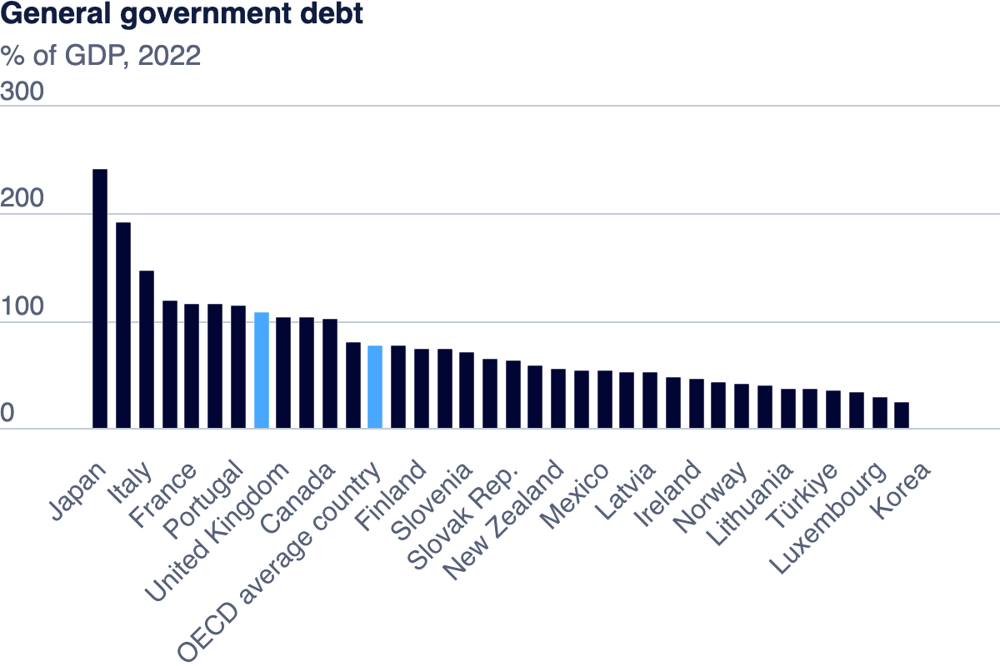

| [home page](https://cmustudent.github.io/tswd-portfolio-templates/) | [visualizing debt](visualizing-government-debt) | [critique by design](critique-by-design) | [final project I](final-project-part-one) | [final project II](final-project-part-two) | [final project III](final-project-part-three) |

# General Government Debt Overview

It is the gross debt of the general government expressed as a percentage of GDP. Debt is calculated as the sum of the following liability categories where applicable: currency and deposits, debt securities, loans, insurance, pensions and standardized guarantee schemes, and other accounts payable. This indicator serves as a key measure of the sustainability of government finance, with changes in government debt over time primarily reflecting the impact of past government deficits.

## Part One: Working with Web-Based Visualization Tools and Data

I downloaded this image from the oecd.org site, which enabled me to manipulate and display the data in a user-friendly format. The main objective was to identify trends, patterns, and outliers within the dataset.

For this part of the assignment, I used web-based visualization tools to analyze data on general government debt across various countries. The visualization, titled **General government debt**, provides a clear representation of the debt levels, expressed as a percentage of GDP, for different nations. The data highlights the comparative debt burdens and allows for insights into how economic policies and fiscal management vary globally.

## Working with Tableau

<noscript>
</noscript>
  <object class='tableauViz'  style='display:none;'>
    <param name='host_url' value='https%3A%2F%2Fpublic.tableau.com%2F' /> 
    <param name='embed_code_version' value='3' /> <param name='site_root' value='' />
    <param name='name' value='GDPHeatmap_17259971480980&#47;TotalGovernmentDebtRepresentation-TreeMaps' />
    <param name='tabs' value='no' />
    <param name='toolbar' value='yes' />
    <param name='static_image' value='https:&#47;&#47;public.tableau.com&#47;static&#47;images&#47;GD&#47;GDPHeatmap_17259971480980&#47;TotalGovernmentDebtRepresentation-TreeMaps&#47;1.png' /> 
    <param name='animate_transition' value='yes' />
    <param name='display_static_image' value='yes' />
    <param name='display_spinner' value='yes' />
    <param name='display_overlay' value='yes' />
    <param name='display_count' value='yes' />
    <param name='language' value='en-US' />
    <param name='filter' value='publish=yes' />
  </object>

                

## Part three: create your own visualization

_Create another data visualization using the same data used earlier. DO NOT submit something that's just a minor modification of one of the visualizations already covered here. So, don't just modify the colors or labels of one of the earlier examples and call it good, or submit a slightly modified bar chart.  Instead, see what you can come up with on your own, and spend some time to try and create something that tells a story about the data._

_Summarize in a paragraph or two about the different methods of visualization, and how they compare / contrast to one another. Make sure you include all source information and explain the data well.  Talk about why you chose the third data visualization.  Be specific - keep your writeup relevant to the assignment, and avoid jargon-filled language that doesn't say anything useful._

_It's a good idea to go back and review your work.  Could someone follow your process and understand what you did?  Do you need to further connect any of the sections with a bit of text?  Is it something you'd be happy to have as an example of your work from the class?_

